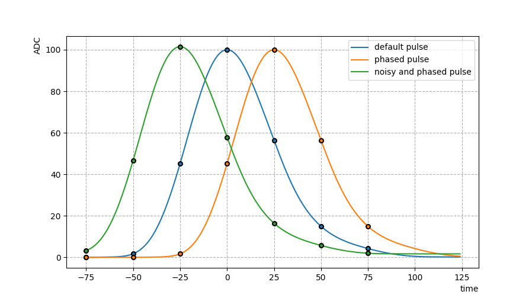
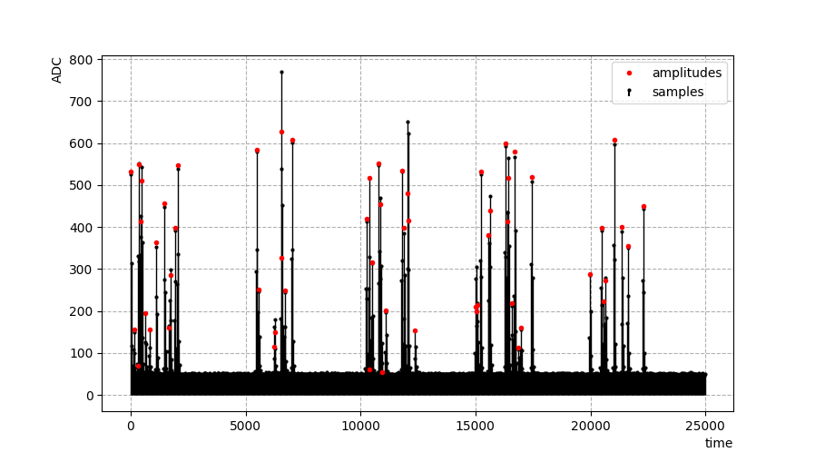

# CPS - Calorimetry Pulse Simulator

Set of functions in C++ and Python for generating typical analog and digital
calorimetry signals with the ability to simulate phenomena such as electronic
noise, signal pileup, phase shift, baseline, among others.

Useful links:
 - [API Reference](https://ingoncalves.github.io/calorimetry-pulse-simulator/)
 - [Examples](./docs/examples)

## Getting started

Please, follow the instructions for Unix based SO. Requires
[SWIG](http://www.swig.org), and [CMake](https://cmake.org) version 3.8.

1. Create a build directory and make it the current directory

```shell
mkdir build
cd build
```

2. Configure

```shell
cmake ..
```

3. Build

```shell
make
```

4. Install

```shell
make install
```

You are now ready to use the CPS lib in C++ and Python applications.


## Examples

Find **C++**, and **Python**, and CERN **ROOT** examples at `docs/examples/` folder.


### Analog pulses and digital samples



#### Python example

```python
from pycps import AnalogPulse, TextFilePulseShape, Digitizer

pulse_shape = TextFilePulseShape("unipolar-pulse-shape.dat")
digitizer = Digitizer(7, 25, -75)

# centralized pulse (blue)
amplitude = 100.0
pedestal = 0.0
default_pulse = AnalogPulse(pulse_shape, amplitude)
default_samples = digitizer.digitize(default_pulse)

# phased pulse (orange)
phase = -25
phased_pulse = AnalogPulse(pulse_shape, amplitude, pedestal, phase)
phased_samples = digitizer.digitize(phased_pulse)

# noisy and phased pulse (green)
phase = 25
noise_mean = 0
noise_sigma = 1.5
noisy_and_phased_pulse = AnalogPulse(
    pulse_shape,
    amplitude,
    pedestal,
    phase,
    noise_mean,
    noise_sigma
)
noisy_and_phased_samples = digitizer.digitize(noisy_and_phased_pulse)
```

#### C++ example
```cpp
#include <cps/TextFilePulseShape.h>
#include <cps/AnalogPulse.h>
#include <cps/Digitizer.h>

using namespace cps;

TextFilePulseShape* pulseShape = new TextFilePulseShape("unipolar-pulse-shape.dat");
Digitizer* digitizer = new Digitizer(7, 25, -75);

// centralized pulse (blue)
double amplitude = 100.0;
double pedestal = 0.0;
AnalogPulse* defaultPulse = new AnalogPulse(pulseShape, amplitude);
std::vector<double> defaultSamples = digitizer->Digitize(defaultPulse);

// phased pulse (orange)
double phase = -25;
AnalogPulse* phasedPulse = new AnalogPulse(pulseShape, amplitude, pedestal, phase);
std::vector<double> phasedSamples = digitizer->Digitize(phasedPulse);

// noisy and phased pulse (green)
phase = 25;
double noiseMean = 0;
double noiseSigma = 1.5;
AnalogPulse* noisyAndPhasedPulse = new AnalogPulse(
    pulseShape,
    amplitude,
    pedestal,
    phase,
    noiseMean,
    noiseSigma
  );
std::vector<double> noisyAndPhasedSamples = digitizer->Digitize(noisyAndPhasedPulse);
```

### Pulses and Dataset generation



#### Python example

```python
import numpy as np
from pycps import TextFilePulseShape, PulseGenerator, DatasetGenerator, Random

# set the random engine seed
Random.seed(0);

# read pulse shape
pulse_shape = TextFilePulseShape("unipolar-pulse-shape.dat")

# setup the pulse generator
pulse_generator = PulseGenerator(pulse_shape)
pulse_generator.set_amplitude_distribution(PulseGenerator.UNIFORM_REAL_DISTRIBUTION, [0, 1024])
pulse_generator.set_phase_distribution(PulseGenerator.UNIFORM_INT_DISTRIBUTION, [-5, 5])
pulse_generator.set_deformation_level(0.01)
pulse_generator.set_noise_params(0, 0)
pulse_generator.set_pedestal(40)

# setup the datataset generator
dataset_generator = DatasetGenerator()
dataset_generator.set_pulse_generator(pulse_generator)
dataset_generator.set_occupancy(0.1)
dataset_generator.set_sampling_rate(25.0)
dataset_generator.set_noise_params(0, 1.5)
dataset_generator.set_events_scheme([\
    DatasetGenerator.allowed_events_block(100),\
    DatasetGenerator.not_allowed_events_block(100)\
])

# generate a continuous dataset
n_events = 10000
dataset = dataset_generator.generate_continuous_dataset(n_events)

# or generate a sliced dataset
n_slices = 10000
slice_size = 7
dataset = dataset_generator.generate_sliced_dataset(n_slices, slice_size)

# access the generated time, samples, and amplitudes series
time = np.array(dataset.time)
samples = np.array(dataset.samples)
amplitudes = np.array(dataset.amplitudes)
```

#### C++ example

You must compile with C++17 standard (ex: `g++ -std=c++17 main.cpp -o main -w -lcps`).

```cpp
#include <cps/TextFilePulseShape.h>
#include <cps/PulseGenerator.h>
#include <cps/DatasetGenerator.h>
#include <cps/Random.h>

using namespace cps;

int main() {
// set the random engine seed
Random::Seed(0);

// read pulse shape
TextFilePulseShape* pulseShape = new TextFilePulseShape("unipolar-pulse-shape.dat");

// setup the pulse generator
PulseGenerator* pulseGenerator = new PulseGenerator(pulseShape);
pulseGenerator->SetAmplitudeDistribution(PulseGenerator::UNIFORM_REAL_DISTRIBUTION, {0, 1024});
pulseGenerator->SetPhaseDistribution(PulseGenerator::UNIFORM_INT_DISTRIBUTION, {-5, 5});
pulseGenerator->SetDeformationLevel(0.01);
pulseGenerator->SetNoiseParams(0, 0);
pulseGenerator->SetPedestal(40);

// setup the datataset generator
DatasetGenerator* datasetGenerator = new DatasetGenerator();
datasetGenerator->SetPulseGenerator(pulseGenerator);
datasetGenerator->SetOccupancy(0.1);
datasetGenerator->SetSamplingRate(25.0);
datasetGenerator->SetNoiseParams(0, 1.5);
datasetGenerator->SetEventsScheme({
    DatasetGenerator::AllowedEventsBlock(100),
    DatasetGenerator::NotAllowedEventsBlock(100)
});

// generate a continuous dataset
unsigned int nEvents = 10000;
auto dataset = datasetGenerator->GenerateContinuousDataset(nEvents);
// access the generated time, samples and amplitudes series
std::vector<double> time = dataset->time;
std::vector<double> samples = dataset->samples;
std::vector<double> amplitudes = dataset->amplitudes;

// or generate a sliced dataset
unsigned int nSlices = 10000;
unsigned int sliceSize = 7;
auto dataset = datasetGenerator->GenerateSlicedDataset(nSlices, sliceSize);
// access the generated time, samples, and amplitudes series
std::vector<std::vector<double>> time = dataset->time;
std::vector<std::vector<double>> samples = dataset->samples;
std::vector<std::vector<double>> amplitudes = dataset->amplitudes;

return 0;
}
```


## Cite

Please, cite this project using the following reference:

> GONÇALVES, Guilherme Inácio et al. Performance of Optimal Linear Filtering Methods for Signal Estimation in High-Energy Calorimetry. Journal of Control, Automation and Electrical Systems, p. 1-11, 2022.

Or, using bibtex format:

```bib
@article{gonccalves2022performance,
  title={Performance of Optimal Linear Filtering Methods for Signal Estimation in High-Energy Calorimetry},
  author={Gon{\c{c}}alves, Guilherme In{\'a}cio and Peralva, Bernardo Sotto-Maior and de Seixas, Jos{\'e} Manoel and de Andrade Filho, Luciano Manh{\~a}es and Cerqueira, Augusto Santiago},
  journal={Journal of Control, Automation and Electrical Systems},
  pages={1--11},
  year={2022},
  publisher={Springer}
}
```

Link to the paper: https://link.springer.com/article/10.1007/s40313-022-00907-0


## Development

Below is some useful information for developers.

### Tests

To run the automated tests, go the `build` folder and run

```shell
ctest
```


### Build Documentation

Requires [Doxygen](https://www.doxygen.nl/).
Might need to run `cmake ..` again if you installed Doxygen after running it.

```shell
cmake ..
make docs
```

### Author

**Guilherme Gonçalves**

* [github/ingoncalves](https://github.com/ingoncalves)
* [ggoncalves@iprj.uerj.br](mailto:ggoncalves@iprj.uerj.br)

### License

Copyright © 2022, [Guilherme Gonçalves](https://github.com/ingoncalves).
Released under the [GNU GPL License](LICENSE).
